# Подключили модель мозга мухи к NPC в Unreal

Кажется, в сентябре «мозг мухи» торчит из каждого чайника. На GitHub уже есть и [DOOMFLY](https://github.com/nftechie/doomfly), где такую модель подключили к Doom, и [муха, гуляющая по окнам macOS](https://github.com/DenisSergeevitch/desktop-fly).

Мне стало интересно, можно ли использовать модель мозга мухи для игровых NPC. Хотелось сделать небольшой биом, в котором существа ищут еду, защищают территорию, размножаются и живут своей жизнью, пока игрок занят чем-то другим.

Эксперимент работал на Mac с M2 Pro и 32 ГБ памяти, в Unreal Engine 5.8.2. Игра и расчёт нейронных моделей запускались на одной машине; для моделей использовался GPU через Metal.

Тестовый RPG-проект на Unreal уже был, так что я попросил Codex собрать эксперимент прямо в нём. Взяли два готовых проекта, [SiliconFly](https://github.com/dawsonamf/siliconfly) и [FlyBrainEngine](https://github.com/mehrantsi/flyBrain), подключили их к инсектоидам и поселили на карте две колонии. Я смотрел на жуков в игре, останавливал симуляцию и просил разобрать логи. После нескольких доработок оставили её работать почти на шесть часов.

Проект с жуками, адаптерами и скриптами экспериментов выложен [на GitHub](https://github.com/Rexarrior/mosswild-fly-brain). Инструкция запуска — в README; проверяли на macOS с Apple Silicon.

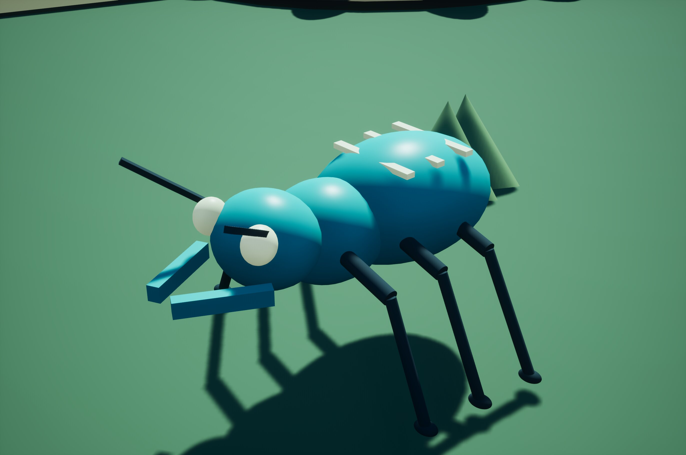

*Один из жителей биома. Крупный план снят отдельно в Unreal; тело собрано из простых геометрических фигур.*

Оба движка используют коннектом дрозофилы из [FlyWire](https://flywire.ai/) — карту соединений между нейронами. В наших версиях получается около 139 тысяч нейронов на особь. Их активность рассчитывается на GPU через Metal. Модели нейронов при этом упрощённые: одна карта связей ещё не воспроизводит работу настоящего мозга.

Чтобы связать такую модель с игрой, пришлось написать довольно много обычного игрового кода. C++ отвечает за потребности, бой и размножение. В первой версии, если жук был голоден, этот код выбирал еду и переводил направление к ней в сигналы для нейронной модели. Декодер считывал активность выходных нейронов и определял скорость и поворот жука. На этом этапе модели досталось управление движением; выбор целей остался в игровом коде.

<spoiler title="Что именно решают модель, адаптер и игровой код">

Граница управления одинакова для SiliconFly и FlyBrainEngine. На схеме показан вариант Mosswild с планировщиком, который использовался в ночном запуске. Ниже разобраны его доработки, а ближе к концу — новый опыт с раздражителями вместо выбора цели.

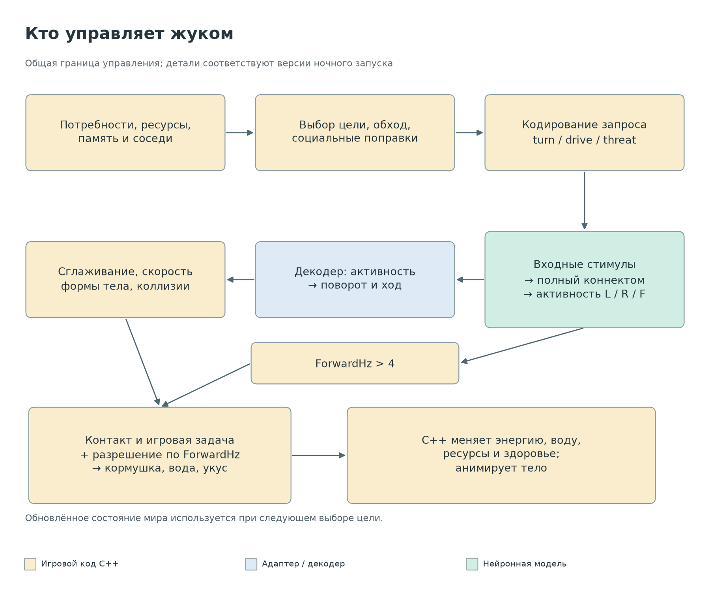

| Участник | Что делает |
|---|---|
| Игровой планировщик, C++ | Выбирает задачу и конкретную цель. Учитывает потребности, ресурсы, память, соседей, препятствия и территорию. |
| Сенсорный интерфейс | Превращает подготовленное направление в `turn`, задаёт возбуждение движения `drive` и сигнал `threat`. Это искусственные стимулы, а не изображение с камеры жука. |
| Нейронная модель | Распространяет активность по коннектому. Её измеренные выходы участвуют в формировании поворота и движения вперёд. Состояние каждого NPC сохраняется между запросами. |
| Декодер в Python-сервисе | Преобразует измеренные частоты в нормированные команды поворота и хода. Не получает координат, цели или голода. |
| Тело и экология, C++ | Сглаживают команды, задают скорость формы тела, учитывают груз и коллизии. Меняют запасы, энергию, воду и здоровье; создают яйца и анимируют ноги и челюсти. |

Для поворота стимулируются выбранные пресинаптические партнёры DNa01/DNa02, для движения вперёд — партнёры DNp09. Сами выходные нейроны внешним сигналом напрямую не возбуждаются. Декодер читает левую и правую группы DNa и группу DNp09: условные `L`, `R`, `F`. У двух движков частоты оцениваются по-разному, поэтому калибровка у каждого своя.

Есть ещё связь модели с действиями: кормление у источника и питьё требуют подходящей задачи, расстояния до ресурса меньше 155 см и `ForwardHz > 4`. Голодный жук также может съесть часть собственного груза вне кормушки — с тем же порогом активности. Укус требует задачи `Defend`, готовой перезарядки, близкой цели и того же порога. Объём еды, урон и анимацию задаёт C++. Разгрузка и кладка отдельного нейронного порога не проверяют.

Сигнал `threat` в Mosswild выставляет C++, когда уже включён режим отступления. Активность GF возвращается как диагностика, но игровое бегство ею не управляется. Управление отдельными суставами тоже остаётся процедурной анимацией.

</spoiler>

Даже с этой задачей всё заработало далеко не сразу. В одной из версий три жука под управлением SiliconFly умерли от голода возле еды. Они кружили рядом с выбранной целью и не могли нормально к ней подойти.

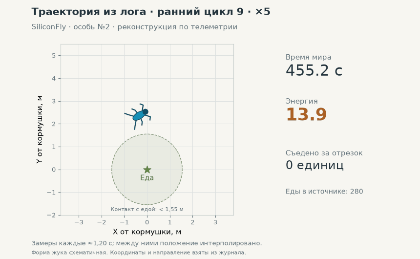

*Жук №2 в девятой версии эксперимента. Это реконструкция по координатам из журнала, ускоренная в пять раз: между замерами положение интерполируется. Еда остаётся рядом, но жук её не ест, а энергия заканчивается.*

Перед этим мы обучили декодер восстанавливать команды скорости и поворота по нейронной активности. Для обучения подавали модели заранее заданные команды и записывали её ответ. На проверочных данных декодер стал ошибаться меньше, но к его выходу мы ещё добавили сглаживание. С ним и переборщили: жуки не успевали довернуть к еде.

<spoiler title="Что обучали и почему сглаживание мешало поворачивать">

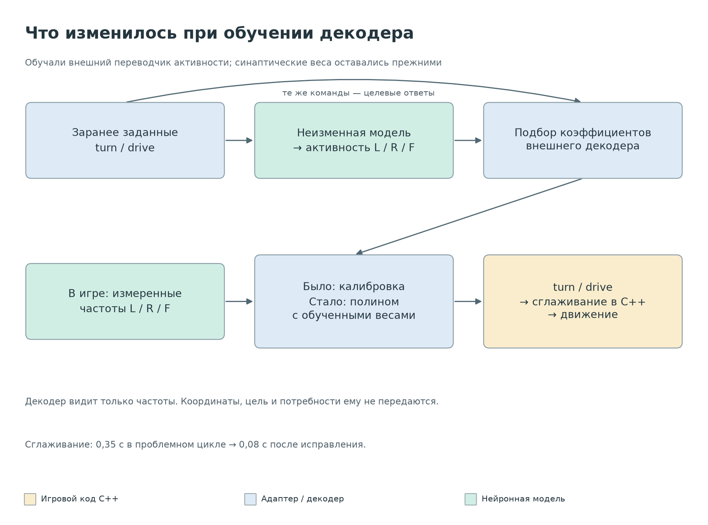

Сначала использовался калиброванный переводчик: разность левой и правой активности задавала поворот, а передняя группа — ход. Начиная с девятой итерации проверяли обученный полиномиальный декодер. Его входы остались прежними: только `L`, `R`, `F`.

При подготовке данных модели задавали известные `turn/drive` и записывали нейронный ответ. По этим парам подбирали коэффициенты регуляризованной регрессии. Десять признаков — константа, три частоты, их квадраты и попарные произведения. В игре декодер восстанавливает две команды по активности, без доступа к желаемому ответу. При слишком слабой активности соответствующая команда обнуляется.

После декодера C++ дополнительно сглаживает команды. В проблемном цикле постоянная сглаживания составляла 0,35 с, после исправления — 0,08 с. Затем игра переводит нормированный поворот в угловую скорость и масштабирует ход скоростью формы тела. Груз и кормление дополнительно замедляют тело.

То есть менялись внешний декодер и обработка его команд. Выбор еды по-прежнему делал планировщик, а синаптические веса и правила нейронной динамики оставались прежними.

</spoiler>

Сглаживание уменьшили. Позже, при запуске с графикой, обнаружилась ещё одна проблема: расчёт шёл асинхронно, и к моменту получения команды жук уже оказывался в другом месте. Помогло учитывать его предполагаемую позицию к приходу ответа. Связи между нейронами мы при этом не меняли; обучение касалось только декодера.

<spoiler title="Как прогноз положения встроен в управление">

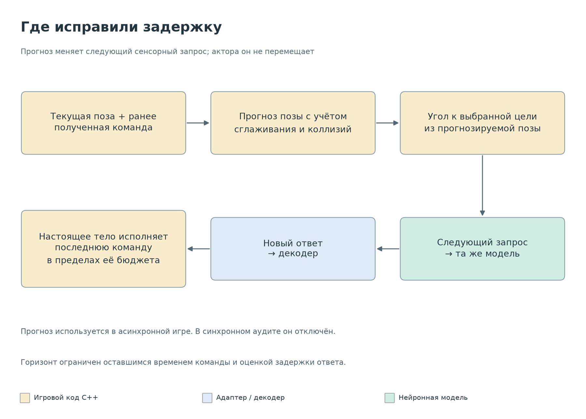

До исправления направление к цели рассчитывалось из текущего положения. Пока модель считала ответ, тело продолжало выполнять предыдущую команду, и новый поворот приходил уже для устаревшей позы.

После исправления C++ сначала прогнозирует положение и угол тела по уже полученной нейронной команде, учитывая сглаживание и коллизии. Из этой предполагаемой позы он рассчитывает следующий сенсорный запрос. Сам прогноз актора не перемещает и моторную команду за модель не придумывает.

Горизонт прогноза ограничен оставшимся бюджетом текущей команды и оценкой задержки ответа. Когда бюджет закончился, игровое движение и экология ждут следующего ответа. В синхронных аудитах мир и так ждал мозг, поэтому прогноз там отключён.

Эту часть добавили после первого провального запуска с графикой. Декодер и нейронная модель при исправлении задержки не менялись.

</spoiler>

Когда жуки стали добираться до еды, обнаружилась проблема с правилами жизни колонии. Они ели сами и относили запасы в гнездо, где еда расходовалась на потомство. В одном из длинных запусков доставка прекратилась примерно на 137-й секунде игрового времени и больше не возобновлялась.

В каждой колонии разрешалось жить не больше шести особей. При достижении лимита новые яйца переставали появляться, а других постоянных расходов мы не предусмотрели. Жуки продолжали есть сами, но запасов в гнезде им теперь хватало и таскать новые было незачем.

Добавили расход еды на содержание гнезда и порчу запасов. За доставку стали отвечать несколько особей, которые периодически сменяют друг друга. Ещё ограничили время сбора: если жук слишком долго не может набрать полный груз, он возвращается с тем, что есть. После этих изменений доставка продолжалась и при полной колонии.

<spoiler title="Кто назначает снабженцев и решает, когда размножаться">

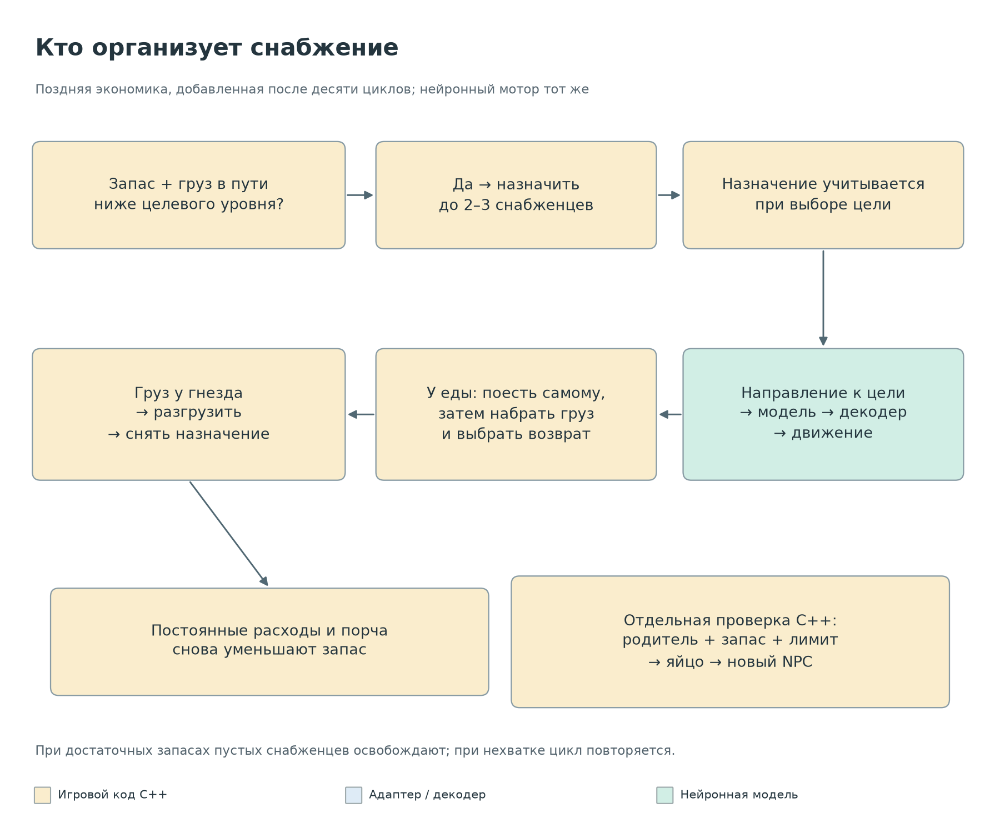

Это поздняя доработка экономики, уже после серии из десяти циклов. Нового нейронного контроллера здесь не появилось: C++ добавил причины выбирать кормовые цели даже сытым особям.

Перед отправкой запроса мозгам игра сравнивает запас гнезда вместе с грузом в пути с целевым запасом `60 + 20 × число живых особей`. При нехватке назначает до двух снабженцев; если запас ниже стоимости кладки, до трёх. Кандидаты должны быть сыты, здоровы, напоены и не отступать. Оценка предпочитает тех, кто дольше не доставлял еду, ближе к гнезду и лучше обеспечен энергией. Так получается ротация работы, без отдельного таймера смен.

Назначение влияет на выбор кормушки и позволяет собирать груз после собственного насыщения. Планировщик учитывает и обратную дорогу. Возврат выбирается при достаточном грузе, истощении его источника либо после 35 секунд с неполным грузом больше двух единиц. У гнезда C++ разгружает жука и снимает назначение. Вода и некоторые условия отступления могут получить более высокий приоритет.

Размножение проверяется отдельно от текущей задачи. Нужны взрослый родитель с достаточными энергией, водой и здоровьем, близость к гнезду, закончившаяся пауза между кладками, свободное место в лимите с учётом яиц, хотя бы 30 еды в гнезде и его состояние выше 55%. Игра списывает 40 энергии родителя и 30 еды гнезда; следующее яйцо возможно через 60 секунд. Потомство получает форму и колонию родителя, но не обучается от его опыта.

Содержание и порча тоже считаются игровым кодом. У живой колонии в секунду расходуется `0,06 + 0,045 × особи + 0,02 × яйца`; затем портится 0,04% оставшегося запаса. Нейронный мотор обеспечивает подход к ресурсам и гнезду, но не ведёт эти расчёты и не распределяет обязанности.

</spoiler>

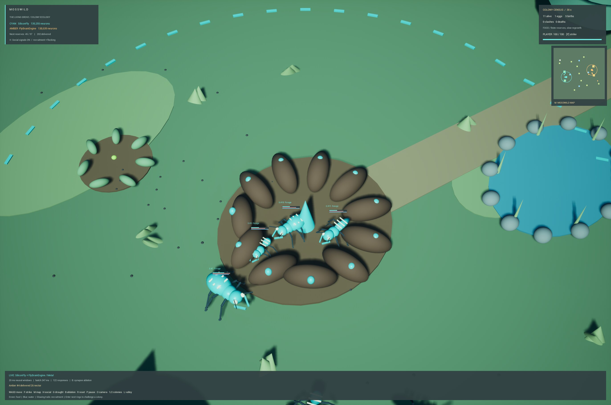

*Гнездо, кормовая точка и вода в одной из тестовых сессий. У существ разные тела, у каждого своё состояние нейронной модели.*

После проверочного прогона оставили симуляцию работать почти на шесть часов. В игровом мире за это время прошло 5 часов 25 минут. Начинали с трёх особей на сторону, к остановке было по шесть.

| За время сеанса | SiliconFly, голубые | FlyBrainEngine, янтарные |
|---|---:|---:|
| Родилось | 13 | 3 |
| Погибло | 10 | 0 |
| Живых к остановке | 6 | 6 |
| Принесено еды, игровых единиц | 8243 | 8044 |

Всего жуки сделали 683 доставки. Запасов хватало на содержание гнёзд, никто не умер от голода или жажды. Две особи почти исчерпали энергию, но успели отъесться. Все десять смертей произошли в боях и пришлись на голубую колонию. Потери она восполняла рождением новых особей.

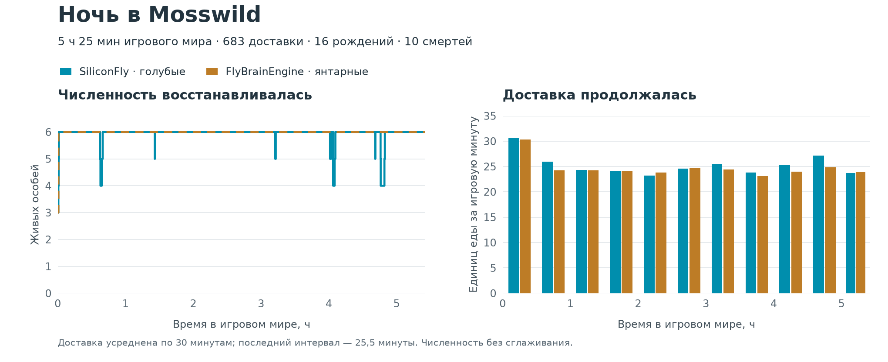

*Слева видно, как голубая колония восполняет потери. Справа показано, сколько еды в среднем приносили за игровую минуту. Столбцы соответствуют получасовым интервалам; последний интервал короче, но рассчитан в тех же единицах.*

По логам удалось восстановить, например, поход жука №15 за водой. Он добрался до источника на стороне янтарной колонии, почти полностью напился, потерял большую часть здоровья, попытался уйти и погиб.

В коде источник воды выбирался по расстоянию, без учёта безопасности пути, а питьё в списке задач стояло выше отступления. Теперь хочется проверить, поможет ли оценка риска при выборе воды и более раннее бегство. По одному логу нельзя сказать, какая из этих правок спасла бы жука.

<spoiler title="Порядок решений: вода, отступление, груз и защита">

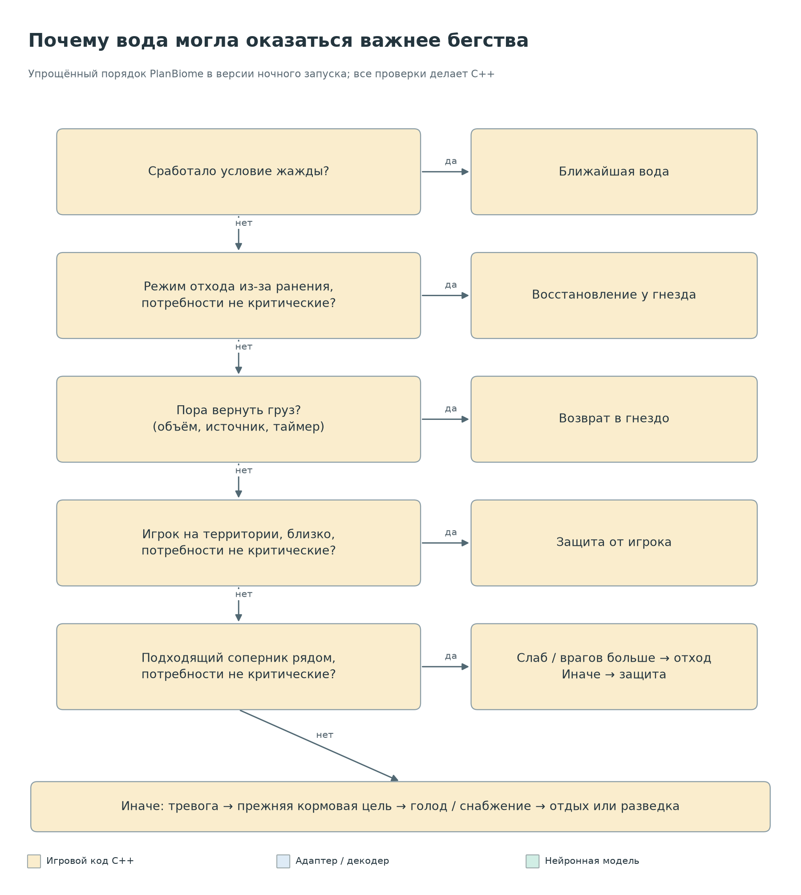

Это порядок проверок в `PlanBiome` версии ночного запуска. Все развилки выполняет C++; модель получает направление к уже выбранной цели. На схеме часть условий сокращена, а пороги ниже даны в игровых единицах.

Питьё выбирается при воде ниже 60 либо продолжается до 95, если жук уже пил. Для похода нужна энергия выше 25; исключение — вода ниже 15. Подходящий источник выбирается по расстоянию. Обычный обход камней при движении есть, а оценки опасности водопоя здесь нет.

Отступление проверяется дважды. Флаг отступления включается при здоровье ниже 25 и снимается выше 49. После проверки воды он позволяет выбрать восстановление, если энергия не ниже 30 и вода не ниже 25. Вторая проверка стоит внутри выбора боя с другим NPC: при здоровье ниже 35 или численном перевесе врагов жук отходит, иначе защищается. Это не одна общая команда «убегать при опасности».

Если более приоритетная задача не выбрана, игра проверяет свежую тревогу, возможность продолжить прежний поход за едой, голод и обязанность снабжения. Подходящая кормушка оценивается по расстоянию, известному запасу, следам и числу уже направленных туда особей. Если её нет — начинается разведка; сытый жук без работы возвращается отдыхать. В конце есть дополнительные поправки: один подходящий взрослый может охранять удалённый ресурс, а добытчик — перенять цель соседнего лидера.

Нейронная модель влияет на то, как жук доберётся до цели. Она не переставляет эти приоритеты и не выбирает безопасный источник вместо ближайшего. Проверка новых приоритетов — ещё предстоящий эксперимент.

</spoiler>

Ещё хотелось добиться роевого поведения: чтобы жуки помогали друг другу находить еду и колония от этого добывала больше. Иногда несколько особей перемещались вместе, но устойчивой кооперации и прибавки к добыче мы пока не увидели.

<spoiler title="Что мы добавляли для совместного движения">

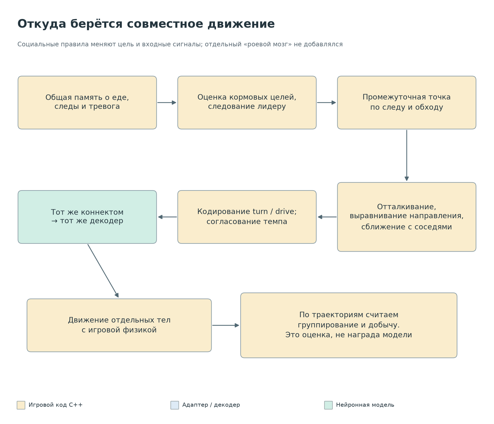

Социальные механики добавлялись в ходе десяти итераций. Все они реализованы в игровом коде: общая память о найденной еде, затухающие следы, передача тревоги, распределение кормовых целей и следование соседнему лидеру.

После выбора цели C++ может взять промежуточную точку на следе своей колонии, учесть обход препятствия и скорректировать направление по соседям. Для слишком близких соседей добавляет направление отталкивания. Для движущихся сородичей с одинаковой задачей и ресурсом — выравнивание направления и сближение; рядом с самой целью эти две поправки выключаются. Жукам разных форм также ограничивается сенсорный запрос скорости, чтобы они могли держать общий темп.

Получившееся направление кодируется в обычные `turn/drive`. Дальше работают тот же коннектом, декодер и тело. Общего нейронного состояния колонии, отдельной обученной политики кооперации и награды мозгу за совместную добычу здесь нет.

Показатели группирования считаются по фактическому движению. Красивой группы на старте у гнезда недостаточно: полезную кооперацию ещё нужно подтвердить добычей и выживанием по сравнению с выключенными социальными поправками. При их отключении базовое раздвижение соседей и территориальные правила сохраняются.

</spoiler>

В том ночном запуске одно обновление нейронного управления для всей группы, примерно двенадцати жуков, занимало около 423 мс по медиане. Расчёт шёл в фоне, поэтому это число не надо переводить в FPS.

Время модели и игры мы связали так: каждые 20 мс нейронной симуляции управляют примерно 400 мс жизни жука. Полный граф связей рассчитывается, но его внутреннее время идёт в двадцать раз медленнее игрового.

После этого попробовали убрать предварительный выбор цели. В новом режиме жук получает сразу несколько сигналов: где вокруг него еда и вода, в какой стороне гнездо, есть ли рядом препятствия. Голод, жажда и груз меняют силу этих сигналов. Они одновременно поступают в разные входные группы модели; куда в итоге пойдёт жук, зависит от её моторного ответа. Заранее назначенной кормушки или маршрута у него теперь нет.

<spoiler title="Что изменилось, когда убрали планировщик">

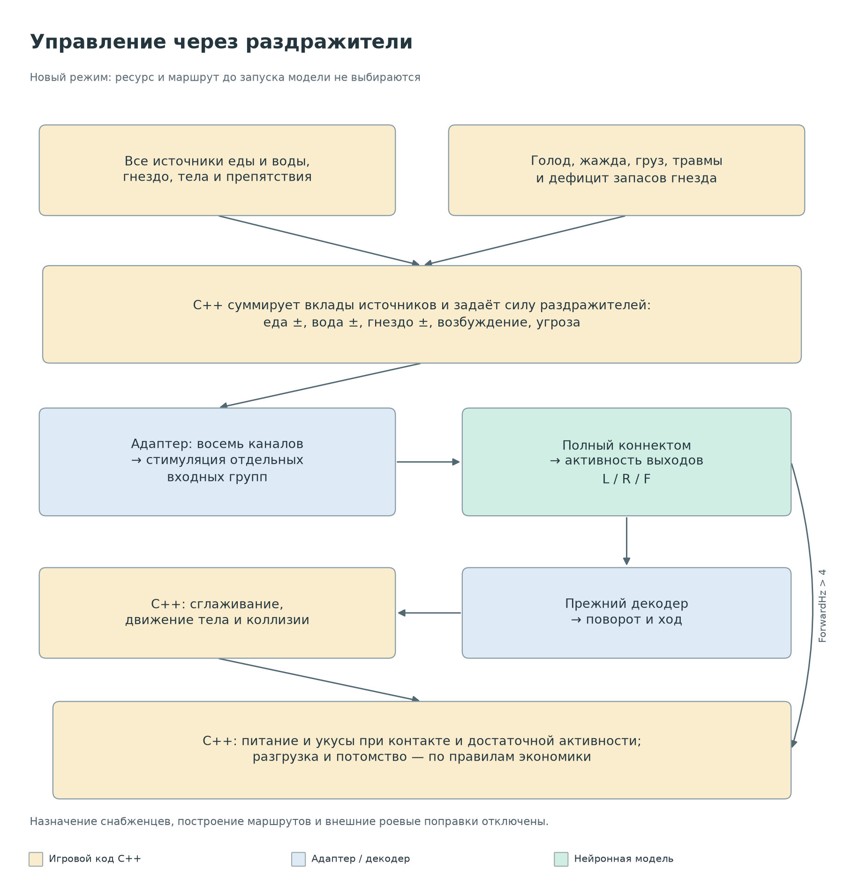

Сенсорный режим включается клавишей `N`; при обычном запуске пока работает планировщик. Переключение сбрасывает обе колонии и состояния их моделей. В сенсорном режиме не вызывается `PlanBiome`. Отключены назначение снабженцев, построение обходного маршрута и внешние поправки для совместного движения.

Игра формирует восемь каналов с неотрицательными значениями. По два канала отведено еде, воде и гнезду: один для положительных углов относительно тела, другой для отрицательных. Ещё два передают общее возбуждение и угрозу. Все источники еды и воды в пределах 30 м добавляют вклад в свою пару; он уменьшается с расстоянием как `(1-d/R)²`. Единственную цель из этих источников игра не выбирает. Сигнал своего гнезда приходит с большего расстояния, до 60 м. Близкие тела, камни и границы карты добавляют сигналы уклонения.

Прежние 24 входных нейрона на каждой стороне разделили на три чередующиеся группы по восемь, усилив стимул на клетку втрое. Это выбранные нами инженерные группы, а не найденные в анатомии мухи центры еды, воды и дома. SiliconFly получает ток, FlyBrainEngine — вероятностные события. Далее работают полный коннектом и прежний декодер частот `L/R/F`. Отдельного нейронного выхода «выбрать воду» здесь нет.

Часть предпочтений мы задали в самом входном интерфейсе: голод усиливает сигналы еды, жажда — воды, а с грузом жук сильнее реагирует на гнездо и слабее на еду. Запас своего гнезда он знает напрямую, без моделирования передачи этой информации. Таким образом, потребности и пространственные сигналы поступают в модель одновременно, но способ их подачи по-прежнему содержит заданные нами правила.

Физика, расход энергии и воды, ёмкость груза, разгрузка и кладка остаются в C++. Теперь жук может есть, пить и кусать противника при непосредственном контакте и достаточной активности выхода движения. Флаг выбранной задачи для этого не нужен. Для сравнения эти же контактные правила включили и у планировщика. Дальнего преследования противника в новом режиме нет; при встрече на своей территории жук может укусить по игровому правилу.

Нейронные связи и моторный декодер в этом опыте не дообучали. Подали конкурирующие сигналы на вход модели и проверили, будет ли жук добираться до ресурсов и выживать с прежним управлением движением.

</spoiler>

Сделали четыре запуска по десять игровых минут: с раздражителями и с планировщиком, для двух начальных состояний. В каждом запуске участвовали обе колонии. При отключённом планировщике жуки находили еду и воду, набирали груз и возвращались к гнёздам. От голода и жажды никто не погиб; все четыре запуска закончились двенадцатью живыми особями. В одном сенсорном прогоне жук погиб в бою. Примерно через 101 игровую секунду родился новый, и численность восстановилась.

По доставке еды получилось близко: 870 против 884 единиц в первой паре, 927 против 931 во второй. Но расходы и желаемый запас гнезда заданы нами, поэтому близкие объёмы доставки сами по себе не означают одинаковое качество управления. В этих условиях колонии снабжали себя без заранее выбранных кормушек и маршрутов.

<spoiler title="Как сравнивали два режима и что получилось">

Карта осталась размером 110 × 96 м: 13 пищевых точек, четыре источника воды и два гнезда. На старте — по три особи на колонию, лимит — по шесть. Для каждого из двух начальных состояний, `seed=1701` и `2701`, выполнили оба режима; порядок их запуска чередовали.

| Режим | Seed | Родилось / погибло | Живых к концу | Доставлено еды |
|---|---:|---:|---:|---:|
| Раздражители | 1701 | 6 / 0 | 12 | 870,2 |
| Планировщик | 1701 | 6 / 0 | 12 | 883,8 |
| Планировщик | 2701 | 6 / 0 | 12 | 931,3 |
| Раздражители | 2701 | 7 / 1 | 12 | 926,7 |

В таблице приведены суммы по двум колониям, еда измеряется в игровых единицах. Итоги включают последний снимок каждого запуска. Единственная смерть отмечена как боевая. По записанным снимкам ни в одном прогоне энергия и вода не опускались ниже принятого критического порога 25.

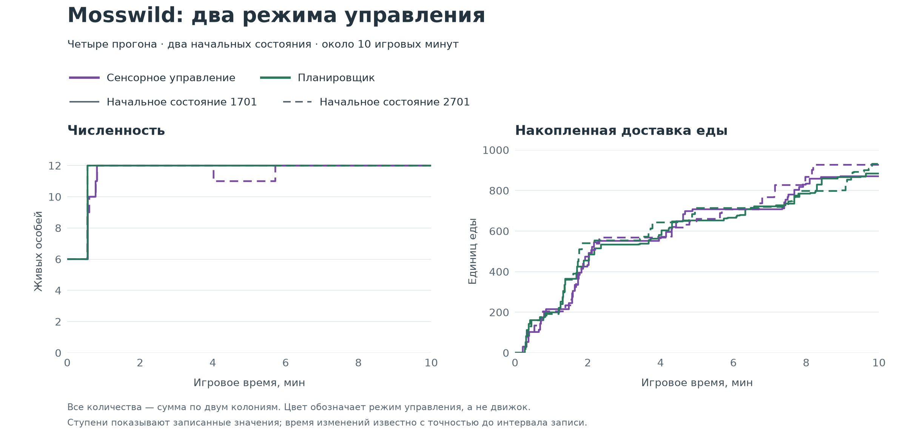

*По горизонтали — время биома. Цвет обозначает режим управления, вид линии — начальное состояние. В сенсорном прогоне 2701 видны потеря одной особи и восстановление численности.*

У обоих режимов отключили внешнее привлечение сородичей и роевые поправки. Планировщик сохранил память о ресурсах, маршрутизацию и локальное отталкивание соседей. Сенсорный режим получает поле раздражителей и сигналы уклонения. Контактные правила одинаковы, но доступная информация и её обработка различаются: мы сравниваем два способа управления целиком. От прежнего шестичасового запуска этот опыт также отличается новыми контактными правилами.

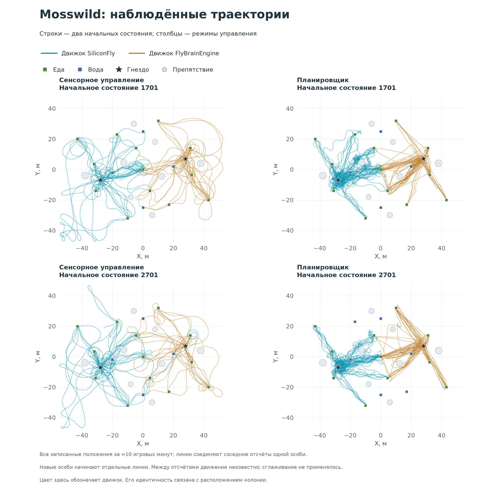

*Здесь цвет уже обозначает движок: голубой — SiliconFly, янтарный — FlyBrainEngine. Показаны все записанные траектории, а не выбранные удачные походы. В сенсорном режиме заметны широкие петли; планировщик чаще повторяет маршруты между ресурсами.*

Десять минут биома занимали от 13,6 до 16,7 минуты реального времени. Медианное время расчёта нейронного пакета составляло 509–660 мс в зависимости от прогона; это не длительность кадра. Масштаб времени остался прежним: 20 мс модели дают до 400 мс движения тела. В фоне был открыт и другой редактор Unreal, поэтому это не изолированный замер производительности.

Два начальных состояния и предел в двенадцать взрослых не позволяют судить о долгосрочной устойчивости. Движки всё ещё привязаны к сторонам карты. А более извилистые траектории сами по себе не доказывают естественность поведения или появление роя.

</spoiler>

С новыми сигналами обнаружился перекос в управлении. Декодер обучался на прежних моторных сигналах, а теперь получает активность от нескольких раздражителей сразу. При равных встречных сигналах FlyBrainEngine выдавал почти одинаковые частоты слева и справа, но декодер всё равно выдавал заметную команду поворота в одну сторону. Для новых входов его нужно отдельно проверить и откалибровать.

<spoiler title="Доходит ли раздражитель до моторного выхода">

Помимо игры проверили 11 комбинаций входов на трёх seed у каждого движка — всего 66 проб. В каждой было 32 окна по 20 мс; первые 12 исключали из среднего. Односторонние сигналы давали ожидаемый знак поворота. Когда сигналы еды и воды подавались с противоположных сторон, изменение их относительной силы меняло знак моторного ответа у обоих движков.

При равных встречных входах у FlyBrainEngine средние выходные частоты составили 188,75 и 185,83 Гц, а декодированный поворот — −0,215 по шкале от −1 до 1. Такой перекос наблюдается на выходе всей моторной цепочки. Декодер оставили прежним; после калибровки его работу на этих сочетаниях раздражителей нужно будет проверить отдельно.

При отключении синаптических связей с сохранёнными входами декодер выдавал нулевые команды хода и поворота во всех тестовых начальных состояниях. В отдельной игровой проверке дрейф составил 0 см. У SiliconFly в одной изолированной пробе сохранилась небольшая активность выхода движения до декодирования, поэтому полной нейронной тишины здесь не было. Проверка показывает зависимость движения от синаптического пути, но не необходимость всех 139 тысяч нейронов.

Контактные действия дополнительно проверяли скриптом, который перемещал персонажей к еде, воде, гнезду и игроку. Так проверялась работа игровых правил при контакте. Самостоятельный поиск мы наблюдали в отдельных десятиминутных прогонах.

</spoiler>

Оставалось проверить, нужен ли здесь вообще мозг мухи. Раз голод уже усиливает сигнал еды, а груз — сигнал гнезда, возможно, большую часть работы мы сделали, когда придумали эти входы.

Вместо коннектома с декодером подключили несколько строк кода: сложить сигналы с каждой стороны, повернуть туда, где они сильнее, и выбрать скорость. Доступа к карте, готовой цели или памяти о кормушках у этого контроллера нет. Для сравнения запустили оба варианта ещё по четыре раза, теперь на полчаса игрового времени.

<spoiler title="Что заменили в контрольном опыте">

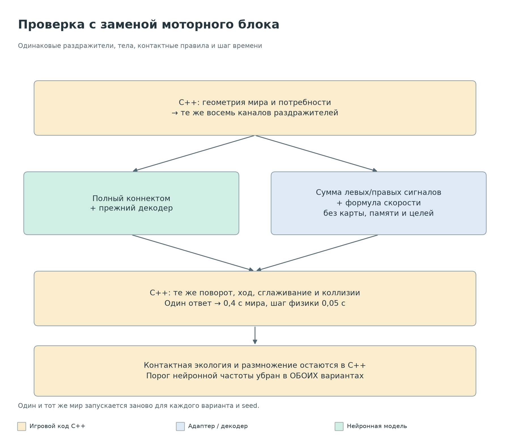

В обоих вариантах C++ формирует те же восемь каналов по прежним формулам. Сами значения, конечно, расходятся, когда жуки идут разными путями. Не менялись ресурсы, потребности, формы тел, сглаживание движения, коллизии, расходы и размножение. Планировщик и внешние роевые поправки отключены.

Простой контроллер `reactive-v1` устроен так; `c0…c5` — пары еды, воды и гнезда, `c6` — возбуждение, `c7` — угроза:

```text
разность = (c0-c1) + (c2-c3) + (c4-c5)
поворот = clamp(4 × разность, -1, 1)
ход = min(1, 2 × c6) × (1 - 0,5 × c7) / (1 + |поворот|)
```

Чем сильнее поворот или угроза, тем медленнее ход. У формулы нет собственного состояния и обучения; коэффициенты зафиксировали до основной серии. Нейронные модели и их прежние декодеры тоже не дообучали.

Для сравнения пришлось изменить одно правило мира. Раньше еда и укусы требовали `ForwardHz > 4`, а у простой формулы нейронной частоты нет. Поэтому этот порог убрали **в обоих вариантах**: для еды, питья, поедания собственного груза и укусов. Контакт, территория, перезарядки и остальные условия сохранились. В полях нейронных частот в логах простого контроллера стоят нули. Из-за снятия порога условия этого опыта отличаются от предыдущих прогонов.

Чтобы оба контроллера принимали решения с одинаковой частотой в игровом мире, использовали синхронный режим. Один ответ любого контроллера продвигает мир на 0,4 с, восемью шагами по 0,05 с. Прогноз положения отключён. Четыре seed — `4101`, `5101`, `6101`, `7101`; порядок вариантов чередовали. Сначала проверили подключение минутным запуском, который в итоговую таблицу не вошёл.

В нейронном варианте по-прежнему работают SiliconFly и FlyBrainEngine, каждый на своей стороне карты. В контрольном обе колонии управляются одной и той же формулой. Старые названия движков в её логах обозначают только колонии, а не запущенные нейронные модели.

</spoiler>

Колонии с простой формулой выжили и продолжали носить еду. Во всех восьми запусках к концу было по двенадцать жуков. С формулой они доставляли на 0,25–3,59% меньше еды, чем с нейронным управлением при том же seed. В прогонах с формулой от голода и жажды никто не погиб. В прогонах с коннектомами один жук умер от голода.

<spoiler title="Получасовое сравнение: результаты и цена расчёта">

| Seed | Еда: коннектомы | Еда: формула | Смерти: коннектомы / формула |
|---|---:|---:|---|
| 4101 | 1878,2 | 1873,6 | 0 / 1 в бою |
| 5101 | 1886,4 | 1834,4 | 1 от голода / 0 |
| 6101 | 1906,0 | 1837,5 | 1 в бою / 0 |
| 7101 | 1903,8 | 1848,1 | 0 / 0 |

В таблице приведены суммы по обеим колониям за 30 игровых минут, включая финальный снимок. Все потери были восполнены потомством; запуски закончились шестью живыми особями на сторону. Смертей от жажды не было. В прогонах с формулой энергия и вода не опускались ниже порога 25 ни в одном записанном снимке.

Смерть от голода разобрали отдельно. В прогоне `5101` жук Cyan №3 почти пять игровых минут оставался на месте, хотя команды движения продолжали поступать. Ближайшая кормушка была примерно в 6,7 м, и еда в ней ещё оставалась. Похоже на застревание тела; по этим логам нельзя установить точную причину или заключить, что модель «решила не есть». Примерно через две минуты после его смерти в колонии родился новый жук.

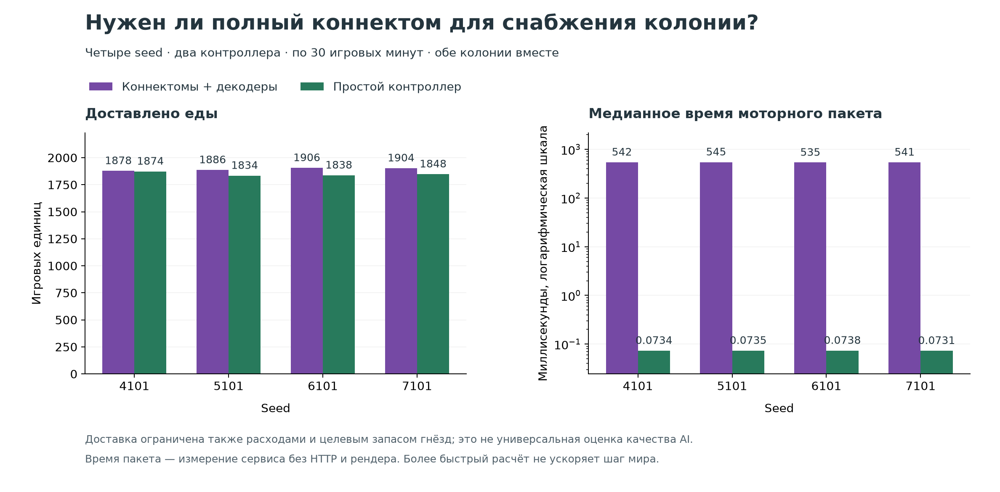

*Слева — доставка в игровых единицах. Справа — медианное время обработки всей группы в сервисе; шкала логарифмическая. Это не время кадра и не FPS.*

На расчёт пакета у формулы уходило примерно 0,073 мс, у коннектомов с декодерами — 535–545 мс. Эти замеры не включают HTTP и отрисовку. На весь получасовой прогон с формулой уходило около двух реальных минут, с нейронным управлением — 40–42 минуты: кроме контроллера, время занимает и остальная работа игры. Серию запускали с одним открытым редактором Unreal.

Двигались жуки по-разному. Суммарный путь всех особей за запуск составил около 23 км у формулы и 12–12,5 км у коннектомов. Близкие объёмы доставки получились при очень разной подвижности; назвать один вариант естественнее по этим числам нельзя. И сама доставка зависит от заданных расходов и желаемого запаса гнёзд.

В анализ вошли все восемь запусков, включая неудачные эпизоды. Хеши исполняемой логики, моделей и общих настроек мира и декодеров совпадают между прогонами. Но это всё ещё один небольшой мир, четыре seed и одна конкретная формула. Движки остались привязаны к сторонам карты, поэтому сравнение не определяет победителя между SiliconFly и FlyBrainEngine. С поведенческими деревьями или небольшой обученной сетью мы пока не сравнивали. Насколько правдоподобно выглядят движения, зрители тоже не оценивали.

</spoiler>

В нашем биоме простой контроллер справился с поиском ресурсов и снабжением гнёзд. Заданные нами потребности и способ подачи сигналов уже позволяют это сделать без полного коннектома. Модель мозга мухи в игре работает, но этот опыт пока не дал причины оплачивать её расчёт ради одной только доставки еды. Вопрос, какие движения выглядят живее и почему, остаётся открытым.
