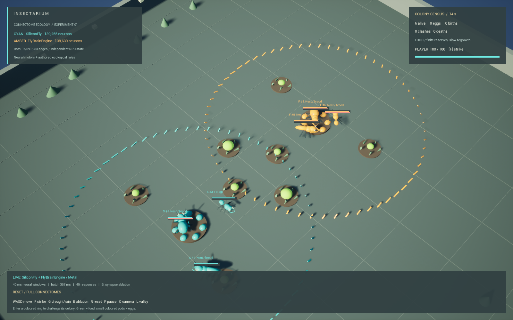
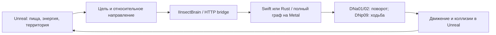

# Insectarium: два коннектома в Unreal

Это первый этап эксперимента. Расширенный биом, новые анимации и длинные
итерации описаны в [Mosswild.md](Mosswild.md). Клавиша L переключает Insectarium и Mosswild.



Эксперимент в `RPGPrototype`, карта `/Game/Maps/Insectarium`, macOS / Apple Silicon.
В публичной версии остались только карты с жуками. Это гибрид нейронного моторного контроллера
и заданных игровых правил экологии. Цели, голод, территориальность и размножение
не «обнаружены» в мозге мухи: их задаёт игра. Поворот и скорость вычисляются из
реальной активности полного коннектома, и отключение его связей нарушает поведение.

## Попробовать

На уже настроенном Mac:

```sh
python3 Scripts/BrainLab/lab.py start
python3 Scripts/ue.py open
```

В редакторе открыть `Content/Maps/Insectarium` и нажать Play. Щёлкнуть в игровое окно для захвата управления.

| Клавиша | Действие |
|---|---|
| WASD, Shift, Space | Перемещение, бег, прыжок |
| Колесо, + / − | Масштаб камеры |
| O | Общий вид лаборатории / камера за героем |
| F | Удар по инсектоидам рядом; они могут укусить в ответ |
| G | Засуха: убрать пищу и остановить рост / вернуть рост |
| B | Сбросить опыт с отключёнными рекуррентными связями / включить связи |
| R | Начать нормальный опыт заново |
| P | Пауза экосистемы |
| L | Перейти между Insectarium и Mosswild |
| Esc | Завершить PIE |

Голубые существа — SiliconFly, янтарные — FlyBrainEngine. В каждой колонии
есть жук, вытянутый богомол и небольшой муравей с разной скоростью и силуэтом.
Цветное кольцо показывает зону нападения на игрока. Зелёные клубни — пища;
маленькие цветные коконы — яйца. Над существами показаны намерение, энергия
и здоровье. HUD показывает население, события, режим абляции и задержку мозга.

Первый ответ после входа или сброса требует создания шести состояний модели.
NPC ожидают сервис. При потере связи устаревшие команды действуют не более
трёх секунд, затем движение и течение их физиологии останавливаются.
Скрытой подмены нейронного управления обычным AI нет.

```sh
python3 Scripts/BrainLab/lab.py status
python3 Scripts/BrainLab/lab.py stop
```

Сервис слушает только `127.0.0.1:18765`, запускается отдельно от игры и не
добавляется в автозагрузку macOS. Во время отсутствия запросов мозги не считают.
После перезапуска сервиса нейронные состояния создаются заново; текущее
состояние экосистемы в открытой игровой сессии сохраняется.

## Восстановить с чистого checkout

Нужны Unreal 5.8.2, Xcode с Metal Toolchain, Swift, Cargo и uv. Если Xcode
показывает `missing Metal Toolchain`: `xcodebuild -downloadComponent MetalToolchain`.

```sh
python3 Scripts/ue.py doctor
python3 Scripts/BrainLab/lab.py setup
python3 Scripts/BrainLab/lab.py probe
python3 Scripts/BrainLab/lab.py experiment
python3 Scripts/ue.py build             # редактор должен быть закрыт
python3 Scripts/ue.py open
python3 Scripts/ue.py script Content/Python/build_insectarium.py
python3 Scripts/BrainLab/lab.py start
```

`setup` скачивает закреплённые ревизии, проверяет SHA-256 данных, создаёт CSR-pack,
выбирает группы нейронов и собирает адаптеры. Повторное построение карты сохраняет
существующие ассеты. Модели, окружение Python и бинарники занимают примерно 1.3 GB
в `Saved/BrainLab/`, исключённом из Git. Карта, материалы, адаптеры, lock-файлы
и результаты эксперимента в `Docs/` входят в проект.

## Что именно подключено

| | SiliconFly | FlyBrainEngine |
|---|---|---|
| Исходник | [dawsonamf/siliconfly](https://github.com/dawsonamf/siliconfly) | [mehrantsi/flyBrain](https://github.com/mehrantsi/flyBrain) |
| Закреплённая ревизия | `8839d84cd24888a4251a2e227792b6f26fbee776` | `cdd3a127766ec184e19c4988fe12b6fd2cbc64fd` |
| Нейроны | 139 255 | 138 639 |
| Направленные рёбра | 15 091 983 | 15 091 983 |
| Контакты в исходных данных | 54 492 922 | 54 492 922 |
| Шаг | 1 ms | 0.1 ms |
| Реализация | Swift + Metal, целочисленное накопление весов | Rust + Metal, float32 состояния |
| Параметры | Настройка автора SiliconFly с фоновым драйвом и шумом | Опубликованные defaults Shiu, включая задержку 1.8 ms |

Rust-адаптер собирает неизменённые модули `metal_engine`, `pack`, `npy`,
`parameters`, `stimulus` и шейдер из исходного репозитория. Его MuJoCo-тело
не используется: телом и физикой служит Unreal. Swift-адаптер аналогично
использует неизменённые `Sim.swift`, `MetalSim.swift` и `LIF.metal`.
Графы не обрезаны до отдельных цепей. Разное число нейронов связано с таблицами
нейронов исходных пакетов; число рёбер и контактов совпадает.

На каждое живое существо создаётся отдельное состояние мембран, задержек,
рефрактерности и генераторов случайных чисел. Состояние сохраняется между
запросами. Умершие освобождают свои состояния. Потомок получает новый seed
и состояние, без наследования памяти родителя. SiliconFly разделяет между
состояниями неизменяемые GPU-буферы графа; Rust-ядро выделяет их для каждого
экземпляра. Лимит экосистемы — 12 живых существ вместе с яйцами.

## Адаптер



`InsectBrain.h` задаёт структуры восприятия и моторного ответа и C++-интерфейс.
`UInsectBrainBridge` передаёт пакет всех NPC неблокирующим HTTP-запросом.
Python-сервис параллельно обслуживает два движка, последовательно обновляя
состояния внутри каждого. Формат `/step` описан непосредственно в `server.py`:
`session`, `ablate`, массив `agents` с `id`, `backend`, `turn`, `drive`, `threat`.
Новый session сбрасывает состояния. Запросы без локального заголовка
`X-BrainLab: 1`, с Origin, неверными числами или более чем 12 NPC отклоняются.

Для поворота выбраны по 24 сильных возбуждающих пресинаптических партнёра
DNa01/02 с предпочтением нужной стороны; ещё 24 входа ведут к DNp09.
Моторные выходы **не стимулируются напрямую**. LC4/LPLC2 принимают сигнал угрозы,
GF служит диагностическим выходом; полёт и полноценная зрительная система
здесь не моделируются. Root ID всех входов и выходов сохранены в `groups.json`.

Восприятие намеренно искусственное: направление уже выбранной игровой цели
кодируется активностью входных групп. Это не решение навигации по зрительной
картинке и не доказательство наличия социальных инстинктов в модели.
Голод и бой не вычисляются LIF-нейронами. Нейронный выход ограничивает движение
и разрешает поедание/укус только при активности моторного выхода.

Декодер получает только измеренные частоты, без доступа к запрошенному повороту:
разность левых/правых DNa нормируется по калибровке, DNp09 задаёт скорость.
`probe.py` калибрует масштаб/смещение по трём seed. Синаптические веса не
дообучались; настройка сенсорного интерфейса не называется дообучением мозга.

В игре один запрос продвигает мозг на 40 ms, примерно раз в 0.3 s или реже,
если расчёт дольше. Между ответами тело продолжает исполнять последнюю команду.
Таким образом, **нейронное время замедлено относительно игрового**. HUD показывает
задержку пакета; это не обещание полного биологического real-time для 12 мозгов.

## Экологическое давление

- Восемь кормовых точек имеют по 75 единиц и восстанавливают 1.4 единицы в секунду.
  Еда поступает только после реального сближения; ресурс убывает на съеденный объём.
- Жизнь расходует 0.48 энергии/сек, движение добавляет до 0.28. Нулевая энергия
  отнимает 5 здоровья/сек. Засуха отключает рост и убирает остатки еды.
- Колонии конкурируют в перекрывающихся территориях. Укус требует дистанции,
  активности мозга, энергии и перезарядки. Раненые отступают и восстанавливаются
  за счёт энергии. Игрок в пределах 850 cm от гнезда становится целью защиты.
- У зрелого здорового существа с энергией ≥105 кладка стоит 48 энергии.
  Яйцо вылупляется через 8 s, следующая кладка возможна через 35 s.
  Размножение упрощённое, бесполое; отбора геномов и обучения потомства нет.
- Это плоская лабораторная арена с простой контактной сенсорикой. Общий поиск
  пути по RPG-ландшафту, полёт, сложные препятствия и сохранения не реализованы.

## Измерения на этом Mac

Apple M2 Pro, 12 CPU / 19 GPU, 32 GB общей памяти; macOS 26.5, Xcode 26.6,
Unreal 5.8.2. Значения ниже относятся к конкретным закреплённым моделям и входам.

В тесте нейронных входов разница между полным левым и правым запросом составила
около 703 Hz для SiliconFly и 533 Hz для FlyBrainEngine (разность групповых частот).
При ходе вперёд DNp09 дал в среднем 204 и 164 Hz соответственно. Абляция связей
уменьшила эти значения до 0.095 и 0 Hz. Это подтверждает причинный вклад связей
в выбранный моторный интерфейс, а не интеллектуальность всего игрового поведения.

Замкнутый опыт: по три seed для нормального режима, отключённых связей и засухи
на каждом backend — 18 прогонов. В норме оба движка находили пищу и выживали.
SiliconFly дал 3 кладки в каждом из трёх прогонов; FlyBrainEngine — 2, 1, 2.
При абляции не было ни кормлений, ни кладок. Без пищи все шесть организмов
в соответствующих прогонах погибли примерно к 107 s.

| 40 ms нейронного времени, один организм | SiliconFly | FlyBrainEngine |
|---|---:|---:|
| Среднее время в нормальном замкнутом опыте | 2.62 ms | 84.49 ms |
| При отключённых связях | 1.41 ms | 9.15 ms |

В собранной телеметрии Unreal для пакетов из шести существ медиана была около
157 ms, p95 — 309 ms; отдельные пакеты при более многочисленной активной
колонии занимали 0.6–0.7 s. Число существ само по себе не определяет время:
важны доля каждого backend и активность сети. Во время проверки шести NPC
RSS процессов моделей был около 244 MiB + 450 MiB (без Unreal; не пиковая
оценка общего потребления всей системы).

Первоначальная проверка требовала полностью нулевого движения при абляции.
SiliconFly её не прошёл: его встроенный шум оставил 17–36 cm суммарного дрейфа
за 108 s против 35–99 m в норме. Итоговая проверка допускает <50 cm, но требует
отсутствия кормлений и кладок. Исходные измерения сохранены; шум не удаляли
специально ради контрольного опыта. FlyBrainEngine без связей не двигался.

## Проверки и артефакты

```sh
python3 Scripts/ue.py script Content/Python/insectarium_smoke.py
python3 Scripts/ue.py smoke                  # регрессия исходной долины
python3 Scripts/BrainLab/check_recovery.py    # переходы карт, потеря сервиса и восстановление
```

Тесты асинхронные: смотреть окончательный `status: completed` и `success: true`,
а не только успех команды запуска Python. `insectarium_smoke.py` проверяет
живые нейронные ответы, перемещение обеих колоний, естественное питание и
вылупление, территориальный бой, нападение на игрока, ответный удар, голод
и абляцию. Для встреч он выставляет исходные позиции; для проверки смерти
в Unreal ставит энергию/здоровье близко к нулю. Полный естественный голод
отдельно проверяется в `experiment.py`.

- `Saved/BrainLab/probe-results.json` — частоты и время, включая контроль без связей.
- `Saved/BrainLab/experiment-results.json` — все 18 опытов и траектории.
- `Saved/BrainLab/experiment-checks.json` — итог проверок замкнутого опыта.
- `Saved/BrainLab/ue-smoke.json` — поведение в Unreal и временные срезы.
- `Saved/BrainLab/events.log`, `batches.jsonl` — события и моторная телеметрия.
- `Saved/BrainLab/provenance.json`, `groups.json` — источники и нейронный интерфейс.
- `Saved/Screenshots/MacEditor/Insectarium_*.png` — проверенные кадры.
- `Docs/BrainLab-results.json` — компактная копия результатов для Git.

Итог проверенного прогона в Unreal: обе колонии перемещались, 54 эпизода
кормления, 8 вылупившихся потомков, 38 атак в территориальных столкновениях,
11 живых существ к концу минутного наблюдения. Отдельные встречи подтвердили
укус игрока и ответный удар. При абляции за 12 s максимум смещения составил
3.1 cm, без кормлений и потомства. Проверки голода, отключения сервиса,
возобновления работы и переходов Elderglen ↔ Insectarium прошли.

Нативная сборка успешна. Регрессия долины (движение, прыжок, карта, маршруты,
коллизии) прошла. Финальный Map Check Insectarium: 0 ошибок, 0 предупреждений.
Во время намеренного отключения сервиса в журнале ожидаемо были HTTP
ConnectionError. Известные стартовые сообщения `LogAutomationTest: Condition
failed` самой установленной сборки UE описаны также в основном README;
они возникают до загрузки лаборатории.

Исходные тесты SiliconFly: `--simtest` и `--gpucheck` прошли. В его отдельном
`--behaviortest` не прошёл тест прилипания настольной мухи к краю окна; эта
механика в Unreal не используется. 11 встроенных тестов выбранных модулей
FlyBrainEngine прошли, включая совпадение sparse/dense stimuli и сохранение
состояния между последовательными окнами.

Код движков распространяется по MIT; исходные данные FlyWire и части моделей
имеют отдельные лицензии, в том числе CC BY-NC 4.0. Для коммерческого выпуска
игры права на данные надо рассматривать отдельно от лицензии программного кода.
Оригинальные уведомления сохранены в скачанных репозиториях (`LICENSE`,
`DATA_LICENSE.md` / `licenses/`). Данные Eon закреплены в `data-lock.json`.
