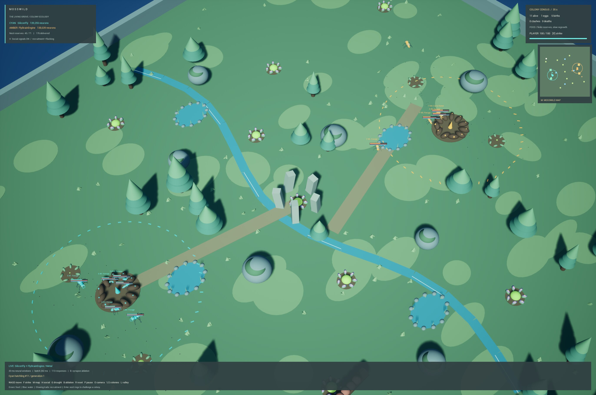
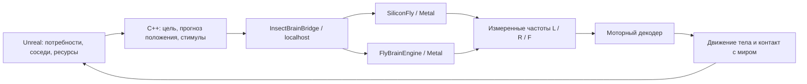
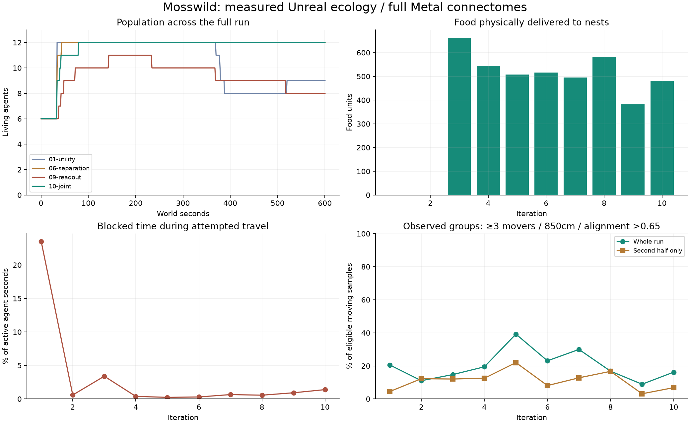
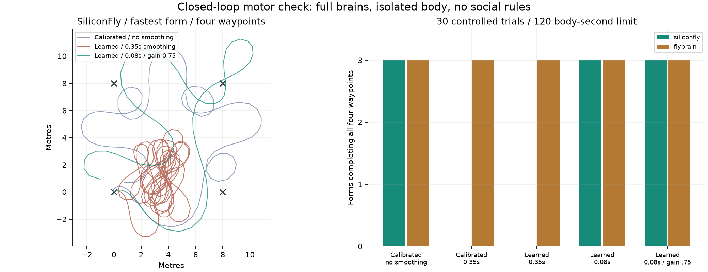
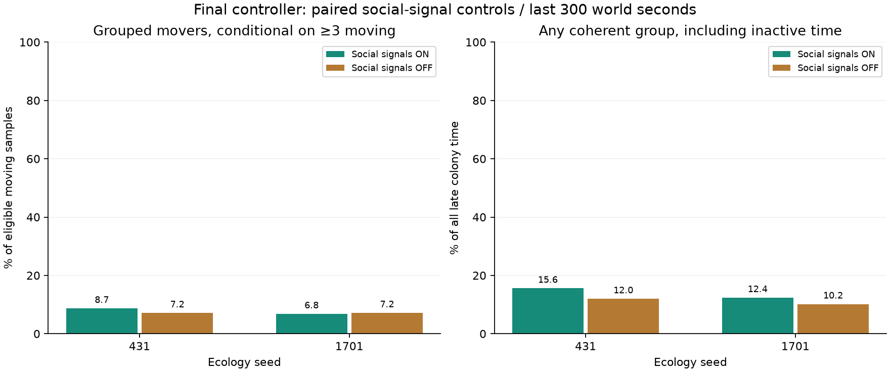
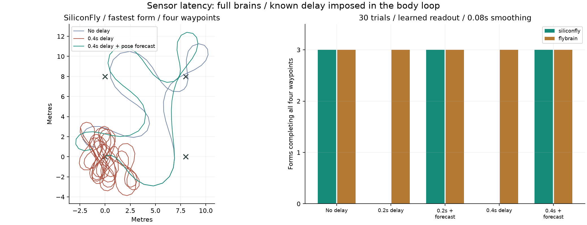
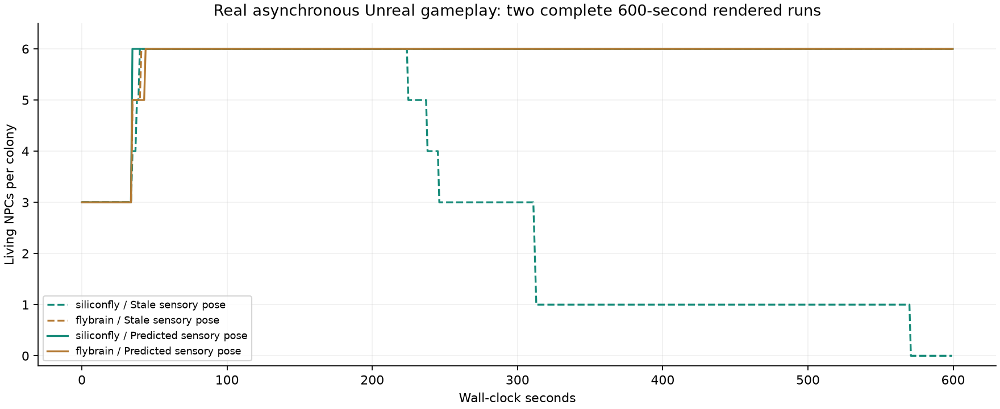

# Mosswild — большой биом с двумя полными коннектомами

Этот отчёт сохраняет результаты исходной серии из десяти циклов (`cf52208`).
Последующее изменение постоянных расходов гнезда, снабжения и журналирования
описано в [Mosswild-economy.md](Mosswild-economy.md); прежние результаты не
пересчитаны задним числом под новую экономику.

Новая карта `/Game/Maps/Mosswild` находится в том же RPGPrototype. Исходная Insectarium сохранена; RPG-долина удалена из актуального проекта. Поляна размером 110 × 96 м в шесть раз
больше лаборатории по площади: 13 кормовых точек, четыре источника воды, два гнезда,
сезонные цветы, руины, поваленное дерево и грибы. Координаты ресурсов и настоящих
препятствий общие для карты и поведения: `Config/BrainBiome.json`.

Проведены десять циклов по десять минут мира, три дополнительных социальных
контроля, 60 изолированных моторных испытаний и два десятиминутных прогона
с графикой. После исправления задержки итоговая игра завершилась с 12 живыми
NPC, шестью рождениями и без смертей. Короткие совместные перемещения есть;
устойчивый рой пока не подтверждён.



[Видео игрового процесса, 21 секунда](Mosswild.mp4) ·
[SiliconFly крупнее](Mosswild-Cyan.jpg) · [FlyBrainEngine крупнее](Mosswild-Amber.jpg).
Ролик собран из 164 кадров обычного игрового окна с сохранением реального
времени между кадрами, примерно восемь снимков в секунду. Частота захвата
ограничивает плавность ролика; замеры самой игры приведены ниже отдельно.

## Запуск

```sh
python3 Scripts/BrainLab/lab.py start
python3 Scripts/ue.py open
```

Открыть `Content/Maps/Mosswild` и нажать Play. Это стартовая карта; **L** переключает её с Insectarium.
**1 / 2** приближают соответствующую колонию; **O** переключает общий вид и
камеру героя. **M** открывает карту с ресурсами, гнёздами и движущимися NPC.
**H** включает/выключает социальные сигналы, **F** — удар, **G** — засуху,
**B** — абляцию связей, **R** — сброс, **P** — паузу. Перемещение — WASD,
бег — Shift, прыжок — Space, масштаб — колесо / + / −.

Три формы имеют разные пропорции и скорость. Ноги движутся чередующимися
тройками; усики сканируют окружение; при еде работают челюсти, при питье
наклоняется голова, при атаке появляется выпад. Груз виден на спине, молодняк
постепенно вырастает. Голубая полоска — вода, цветная — энергия, красная — здоровье.

## Что принимает решения

Полные SiliconFly и FlyBrainEngine сохраняют независимое нейронное состояние
каждого существа. Связи графов не прорежены. Поворот и скорость берутся только
из измеренных выходных нейронов через калиброванный либо обученный readout.
Описание исходников, нейронных групп и адаптеров: [BrainLab.md](BrainLab.md).

Игровые потребности и социальные правила написаны в C++. Это гибридный контроллер,
а не открытие самопроизвольной колонии внутри модели мозга мухи. Он выбирает
цель, преобразует её направление и желаемую скорость в стимулы, а полный
коннектом преобразует стимулы в моторные сигналы.



В игровую экологию входят следующие механики:

- Голод и жажда требуют настоящего сближения с ресурсом. Истощённые места
  восстанавливаются с разной скоростью, некоторые зависят от фазы цветения.
- Избыток еды переносится в гнездо. Кладка расходует энергию родителя и запас
  колонии; яйца вылупляются спустя восемь секунд. Это упрощённое бесполое размножение.
  Если участок исчерпан, существенный неполный груз тоже возвращается в гнездо;
  почти пустые места перестают отвлекать сытых разведчиков.
- Направления к ориентирам известны; память доступности еды ограничена временем
  и радиусом восприятия. Социальный режим
  добавляет обмен обнаружениями и исчезающие следы на обратном пути с грузом.
- Раздвижение соседей, распределение кормовых целей и обход камней предотвращают
  пробки. Для совместного движения добавлены согласование направления,
  сближение и общий темп разных форм.
- Освоенные кормовые точки можно защищать. Слабый или численно уступающий NPC
  отступает; тревога привлекает ближайших сородичей. Один сытый взрослый дежурит
  на удалённом занятом участке, пока собственные потребности позволяют.
  Игрок внутри кольца гнезда или в пределах пяти метров от занятой кормушки
  становится целью защиты. Кормовые границы показаны цветными точками.

Нейронные веса не дообучались. Обучается небольшой регуляризованный полиномиальный
декодер по частотам L/R/F; он не получает координат, целей или желаемой команды
во время игры. Обучение использует seeds 101 и 202, отложенная проверка — 303.
Абляция связей остаётся отдельной проверкой причинной роли нейронного мотора.

## Время и производительность

40 ms окна оказались дорогими при росте популяции до 12 отдельных мозгов.
Со второго кандидата проверяются окна 20 ms. Интеграционный шаг самих моделей
остаётся 1 ms у SiliconFly и 0.1 ms у FlyBrainEngine. Сокращается нейронное время
на игровой шаг, а не размер полного графа. Это не симуляция биологии в реальном времени.

Для сравнения вариантов мир проходит 0.4 секунды только после готового ответа
мозгов, с физическими подшагами не более 0.05 секунды. Рендеринг при аудите
отключён; игровые акторы, столкновения и оба Metal-движка продолжают работать.
Каждый из десяти кандидатов прошёл 600 секунд мира. Реальное время выполнения сохраняется отдельно.
В таком аудите взрослый NPC получает около 30 секунд нейронного времени на
600 секунд мира. Ускорена связь между часами мозга и тела; это существенное
ограничение интерпретации эксперимента.
В интерактивном режиме тело движется плавно по кадрам, но одна старая команда
имеет ограниченный бюджет времени; при долгом расчёте замедляется и экология.
Сенсорный адаптер прогнозирует положение к моменту получения ответа по предыдущей
нейронной команде, учитывая сглаживание и коллизии. Горизонт ограничен оставшимся
бюджетом команды и оценивается по времени последнего пакета. Прогноз меняет только
входное направление; он не двигает NPC и не подставляет моторную команду.
В синхронном аудите этот прогноз не нужен и отключён.

Роевой показатель вычисляется по фактическим перемещениям, а не только по углу
модели или заданной скорости: не меньше трёх движущихся сородичей в радиусе
850 cm, согласованность направлений выше 0.65. Отдельно анализируется вторая
половина прогона, чтобы стартовая группа у гнезда не выдавала себя за устойчивый рой.
Контроль с выключенным **H** отключает обмен находками, следы, согласование
движения и передачу тревоги. Питание, локальное раздвигание, распределение
кормовых целей и территориальные правила продолжают действовать.

Дополнительный строгий показатель исключает цель «гнездо» и особей внутри
собственной территории радиусом 11.5 м. Он считает секунды колонии с согласованной
группой вне гнезда после 300-й секунды. Исходный показатель сохранён, чтобы
поздняя смена определения не подменяла результаты ранних циклов.

## Воспроизведение

Для нового checkout сначала выполнить настройку из [BrainLab.md](BrainLab.md)
и собрать Editor target при закрытом редакторе. Готовая карта и обученный декодер
включены в репозиторий. Скрипт создания карты нужен только при её отсутствии;
существующий уровень он сохраняет. При повторном обучении остановить сервис:

```sh
python3 Scripts/ue.py script Content/Python/build_mosswild.py --timeout 240
python3 Scripts/BrainLab/lab.py stop
Saved/BrainLab/venv/bin/python Scripts/BrainLab/train_readout.py --neural-ms 20 --rounds 3
python3 Scripts/BrainLab/lab.py start
```

Готовые прогоны не перезаписываются. Конфигурации, полные JSONL-трассы и
проверки находятся в `Saved/BrainLab/iterations/`; компактные итоговые метрики
публикуются в `Docs/BrainBiome-iterations.json`. Первый исторический кандидат
использовал 40 ms и раннюю реализацию без новых защит; точное сравнение требует
учитывать сохранённую конфигурацию и хеш сборки. Повторный запуск стадий на
текущем коде проверяет сегодняшнюю реализацию и не воспроизводит автоматически
все промежуточные ошибки старых сборок. Полные снимки исходников сохранены
локально начиная с четвёртого цикла, для первых трёх — хеши и трассы.

Повторить принятую конфигурацию с новым именем прогона, сохраняя старые результаты:

```sh
PYTHONPATH=Scripts/BrainLab python3 - <<'PY'
import json, subprocess, sys
from pathlib import Path
from iterate_biome import run_cycle, command
records = json.loads(Path('Docs/BrainBiome-iterations.json').read_text())
config = next(r['config'] for r in records if r['name'] == '10-joint').copy()
config['name'] = 'repeat-final-1701'  # выбирать новое имя для каждого повтора
Path('Saved/BrainLab/audit-command.json').unlink(missing_ok=True)
subprocess.run([sys.executable, 'Scripts/ue.py', 'script',
                'Content/Python/biome_audit.py'], check=True)
try:
    print(run_cycle(config))
finally:
    command(stop=True)
PY
```

После серии `iterate_biome.command(stop=True)` останавливает PIE и восстанавливает
рендеринг. `python3 Scripts/BrainLab/check_biome.py` запускает проверки действий
игрока, воды, питания, доставки, боя и абляции, десятиминутную игру с рендерингом,
отключение/восстановление сервиса, проверки Elderglen и Map Check.

## Десять измеренных циклов

В каждой строке — отдельный завершённый прогон на 600.33 секунды мира.
Начальная популяция — шесть; предел — двенадцать. Стадии меняют игровые правила,
поэтому таблица отражает ход разработки, а не независимые оценки пользы каждого
отдельного алгоритма. Девятый неудачный вариант сохранён в результатах.

| № | Проверенное изменение | Живых | Смертей | Доставлено | Застревание | Группы во 2-й половине |
|---|---|---:|---:|---:|---:|---:|
| 1 | Цели и поиск в большом биоме | 9 | 4 | 0 | 23.50% | 4.5% |
| 2 | Вода, раздвижение, окно 20 ms | 11 | 1 | 0 | 0.59% | 12.2% |
| 3 | Голод, питание, доставка и кладки | 12 | 1 | 663 | 3.39% | 12.1% |
| 4 | Память, обход камней, завершение еды | 12 | 0 | 545 | 0.38% | 12.5% |
| 5 | Обмен находками и следы | 12 | 0 | 507 | 0.24% | 22.0% |
| 6 | Распределение кормушек и выход из пробок | 12 | 0 | 516 | 0.29% | 8.1% |
| 7 | Совместные походы, согласование движения | 12 | 0 | 495 | 0.65% | 12.8% |
| 8 | Неполный груз, качество еды, риск и охрана | 12 | 0 | 581 | 0.56% | 16.7% |
| 9 | Обученный декодер, сглаживание 0.35 s | 8 | 3 | 382 | 0.92% | 3.1% |
| 10 | Сглаживание 0.08 s, поворот 0.75, пороги | 12 | 0 | 481 | 1.39% | 6.8% |

Доставка измеряется в игровых единицах еды, застревание — доля времени активных
NPC с попыткой движения и малым фактическим смещением. Процент групп условный:
учитывается время, когда в колонии движутся хотя бы три особи. Это не доля всей
симуляции и не доля времени стабильного роя.

В принятом цикле 10: обе колонии по шесть особей, шесть рождений, ноль смертей,
нет отсчётов с энергией ниже 25. В цикле 8 произошло семь естественных ударов
между NPC при освоении территории; в цикле 10 на seed 1701 таких ударов не было.
Бой не подмешивался в длинные прогоны скриптовыми телепортами. Такие постановочные
ситуации используются отдельно для проверки механик.



## Обучение и ошибка сглаживания

На отложенном seed 303 RMSE поворота/скорости уменьшилась: SiliconFly
0.259/0.183 → 0.236/0.151, FlyBrainEngine 0.187/0.170 → 0.136/0.165.
Для каждой модели собрано 1260 измерений: 840 для обучения и 420 для проверки.
Однако меньшая ошибка декодера
сама по себе не гарантирует успешного управления телом.

В девятом цикле три SiliconFly умерли от голода, кружась у кормовых целей.
Дополнительные 30 испытаний полного мозга с изолированным телом (два движка,
три формы, пять настроек, четыре путевые точки) выявили проблему задержки.
При сглаживании 0.35 s SiliconFly не завершил ни один из трёх маршрутов —
и с исходным, и с обученным декодером. При 0.08 s и усилении поворота 0.75
все формы обоих движков прошли маршрут. Среднее время: 37.7 секунды тела у
SiliconFly и 18.0 у FlyBrainEngine. Исходный декодер без сглаживания: 39.2 и
16.8 соответственно; универсального превосходства обучения нет.



Подробные результаты: [декодер](BrainReadout-validation.json),
[30 маршрутов](BrainMotor-tracking.json), [10 циклов](BrainBiome-iterations.json).

## Контроль социальных сигналов

Четыре условия на одной итоговой сборке и настройках: два seed, сигналы включены
или выключены. Прогон 10 повторно используется как условие 1701/ON; остальные
три — дополнительные полные десятиминутные симуляции. Во всех четырёх условиях
12 выживших, шесть рождений, ноль смертей и ноль наблюдений с энергией ниже 25.

| Seed | Сигналы | Доставлено | Ударов NPC | Поздние группы | Группы вне гнезда, с | Вне гнезда ≥3 движущихся, с |
|---|---|---:|---:|---:|---:|---:|
| 1701 | ON | 481 | 0 | 6.8% | 8.4 | 90.0 |
| 1701 | OFF | 543 | 7 | 7.2% | 2.4 | 69.6 |
| 431 | ON | 544 | 1 | 8.7% | 4.8 | 81.6 |
| 431 | OFF | 551 | 7 | 7.2% | 6.0 | 136.8 |

Секунды в двух последних столбцах суммируются по колониям за вторую половину
прогона; максимум — около 600, а не 300. При 1701 сигналы увеличили короткие
совместные выходы, при 431 — не увеличили. Доставка с сигналами тоже ниже в обоих
сравнениях. Убедительного общего преимущества роевого механизма эти два seed
не показывают. Поэтому результат — работающая координация с краткими группами,
но не подтверждённый устойчивый рой или более эффективная коллективная добыча.



Полные компактные метрики: [BrainBiome-controls.json](BrainBiome-controls.json).

## Задержка в обычной игре

Первый полный прогон с рендерингом выявил проблему, отсутствовавшую в синхронном
аудите: за 600 реальных секунд погибли все шесть SiliconFly. Остались шесть
FlyBrainEngine; мир прошёл 550.7 секунды. Неудача сохранена в
[BrainBiome-rendered-before.json](BrainBiome-rendered-before.json), полная трасса —
локально в `Saved/BrainLab/biome-play-before-latency-fix.json`.

Причина проверена отдельными 30 испытаниями полного мозга: два backend, три формы,
нулевая задержка, задержки 0.2/0.4 секунды тела и те же задержки с прогнозом позы.
При обеих ненулевых задержках SiliconFly завершил 0/3 маршрутов; с прогнозом —
3/3. FlyBrainEngine завершил все варианты. Эти испытания задают известную
задержку в изолированной модели тела, без столкновений и рендеринга; они не
подменяют последующую проверку настоящей асинхронной игры.



Исправление добавлено в C++-сенсорный адаптер (`predict_senses` в конфигурации).
Прогноз интегрирует уже полученную нейронную команду и проверяет столкновения
сферой тела. Контроллер передаёт мозгу направление из ожидаемой будущей позы.
Нейронные модели, веса и обученные декодеры не менялись. Все десять исходных
циклов и социальные контроли сохраняют свою ценность для синхронной экологии,
но сами по себе не доказывали работоспособность асинхронного управления.

Подробные результаты: [BrainMotor-latency.json](BrainMotor-latency.json).

Повторная полная проверка асинхронной игры прошла на той же нативной сборке,
которая сохранена в проекте:

| Показатель | После исправления |
|---|---:|
| Реальное время / время мира | 600.02 / 568.14 с |
| SiliconFly / FlyBrainEngine к концу | 6 / 6 |
| Рождений / смертей | 6 / 0 |
| Доставленная еда | 552.79 |
| Естественные удары между NPC | 2 |
| Минимальная наблюдаемая энергия / вода | 39.88 / 48.94 |
| Интервал кадра, медиана / p95 | 23.35 / 28.86 мс |
| Расчёт пакета мозгов, медиана / p95 | 407.72 / 428.54 мс |

Замеры сделаны на **M2 Pro, 12 CPU / 19 GPU, 32 ГБ**, в Editor viewport
2744 × 1818, Screen Percentage 100%. Медиана интервала соответствует примерно
43 кадрам/с; за прогон зарегистрировано 24 843 кадра. Измеряются интервалы
Slate post-tick, а не отдельно время GPU или производительность упакованной игры.
В синхронном цикле 10 без рендеринга медиана пакета была 313.93 мс;
она не заменяет замер с графикой. Асинхронный мир продвинулся медленнее часов,
поскольку просроченные команды ограничены бюджетом движения.



В этой паре прогонов SiliconFly перестал вымирать; FlyBrainEngine выживал
в обоих. Это проверка работоспособности на одном seed, без статистического
доказательства равновесия. Полная запись проверки:
[BrainBiome-validation.json](BrainBiome-validation.json).

Повтор отдельного опыта задержки при остановленных PIE и сервисе, с сохранением
старого результата:

```sh
python3 Scripts/BrainLab/lab.py stop
Saved/BrainLab/venv/bin/python Scripts/BrainLab/track_latency.py \
  --name repeat-latency --report Saved/BrainLab/repeat-latency.json
python3 Scripts/BrainLab/lab.py start
```

## Что пока ограничивает эксперимент

В синхронном аудите конфигурация проверена с двумя начальными состояниями, по 600 секунд
мира каждое: обе колонии достигли шести особей и закончили без смертей и без
наблюдений с энергией ниже 25. Это не проверка равновесия на часы или дни.
Восьмой вариант на основном seed давал больше доставки, меньше застреваний и
больше группового движения; десятый не является победителем по всем метрикам.
Он оставлен как проверенный вариант с обученным моторным декодером.

Предельная популяция — шесть особей на колонию. NPC знают координаты ориентиров;
видимость пищи и память её доступности ограничены, но распознавания изображения
мира нейронной зрительной системой здесь нет. Экология и координация заданы
игровыми правилами, моторика проходит через полный коннектом. Наследования
нейронной памяти, обучения синапсов и эволюции поколений нет.

Новая серия не исследовала дополнительное квантование весов. Ускорение получено
через более короткое нейронное окно и ограничение частоты связи мозга с телом.
Метрики роя показывают короткие эпизоды координации, а не устойчивый коллективный
поиск пищи. Связь между количеством полных мозгов, активностью сети и частотой
кадров нужно измерять на целевой сцене; массовая популяция сверх 12 здесь не
проверена.

## Проверка игровой механики

`biome_smoke.py` проверяет механики действием в PIE: работу обоих полных
backend, блокировку движения открытой картой, подход к воде и питьё, подход к
еде и кормление, естественную доставку, захват удалённой кормушки и нападение
на вошедшего туда игрока, бой NPC, укус игрока, ответный удар и его cooldown,
абляцию/восстановление, полное исчезновение популяции и сброс, голод при засухе,
сохранность источников и восстановление пищи. При абляции в этом коротком
проверочном отрезке смещение было 0 cm, кормлений не было.

Первый запуск выявил ошибку самого теста: он телепортировал одного NPC точно
в коллизию другого у центра гнезда. В отдельном парном опыте наложенные тела
не двигались при живых нейронных командах; нормальная начальная расстановка
дала 13 ударов по игроку за 20 секунд. Исправлена расстановка, игровые правила
не менялись ради прохождения теста. [Результат сравнения](BrainBiome-fixture-check.json).

На итоговой сборке прошли все **19 проверок механики**, пять проверок переходов
между картами и отключения/восстановления сервиса, а также исходные проверки
перемещения и коллизий Elderglen. Editor target собран при закрытом редакторе.
Последний Map Check сохранённой Mosswild: **0 ошибок, 0 предупреждений**.
После игрового прогона через Unreal API поправлены только повороты 22 декоративных
сегментов ручья; коллизии и экология не менялись. Повторный Map Check и просмотр
кадров прошли, карта сохранена без dirty-пакетов.

Полные трассы, логи сборки и промежуточные снимки остаются локально в
`Saved/BrainLab/`. В документации сохранены компактные результаты, в том числе
неудачные варианты, и [журнал работы](BrainBiome-worklog.md).
